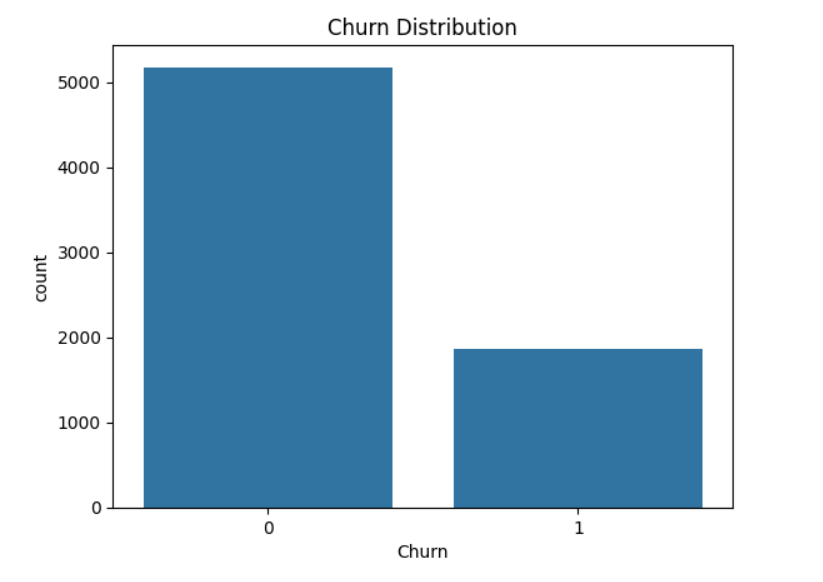
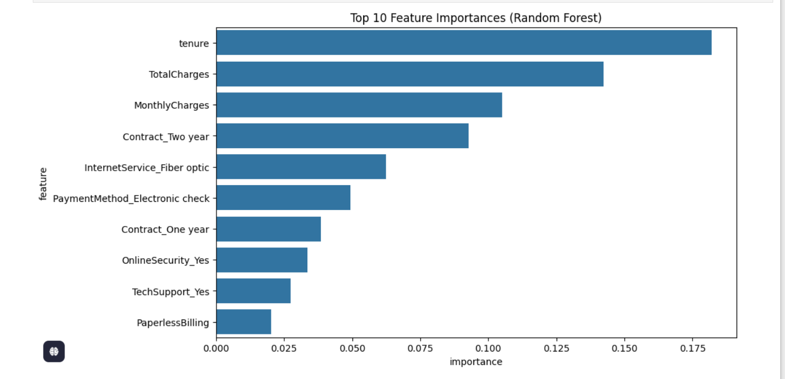

# 📊 Telecom Customer Churn Analysis  

## 🚀 Project Overview  
Customer churn is a major challenge for telecom companies, directly impacting revenue and customer retention.  
In this project, I analyzed a telecom churn dataset to **identify patterns, key churn drivers, and build predictive models** that help businesses take **data-driven retention actions**.  

This project not only demonstrates my **data analysis, machine learning, and visualization skills**, but also showcases how analytics can **add real business value** in the telecom domain.  

---

## 🎯 Objectives  
- Understand **why customers leave (churn)**.  
- Explore **customer behavior** through EDA (Exploratory Data Analysis).  
- Build a **predictive churn model** (Logistic Regression, Random Forest, Gradient Boosting).  
- Provide **business insights** to reduce churn and improve customer loyalty.  

---

## ⚙️ Tech Stack & Skills Demonstrated  
- **Python Libraries**: Pandas, NumPy, Matplotlib, Seaborn, Scikit-learn  
- **Machine Learning**: Logistic Regression, Random Forest, Gradient Boosting  
- **Feature Engineering**: Encoding categorical variables, handling imbalance (SMOTE, class weights)  
- **Model Tuning**: Hyperparameter optimization, cross-validation  
- **Evaluation Metrics**: Accuracy, Precision, Recall, F1-score, ROC-AUC  
- **Visualization**: Interactive plots to communicate insights  

---

## 📈 Workflow  

1. **Data Preprocessing**  
   - Cleaned missing values  
   - Encoded categorical variables  
   - Handled class imbalance using **SMOTE** and **class weights**  

2. **Exploratory Data Analysis (EDA)**  
   - Distribution of churn vs non-churn customers  
   - Churn by contract type, tenure, payment method  
   - Correlation heatmaps and customer behavior insights  

3. **Model Building & Optimization**  
   - Logistic Regression (baseline model)  
   - Random Forest & Gradient Boosting (improved models)  
   - Hyperparameter tuning with GridSearchCV  
   - Cross-validation to ensure generalization  

4. **Model Evaluation**  
   - Compared models on **recall, precision, ROC-AUC** (important for churn prediction)  
   - Best model chosen based on **business requirement: catching maximum churners (high recall)**  

---

## 📊 Visualizations  

### Churn Distribution
  

### Churn by Contract Type
  

### Feature Importance
  

---

## 💡 Key Insights for Telecom Business  

- Customers with **month-to-month contracts** have the **highest churn rate** → Promote long-term plans with discounts.  
- Customers using **electronic check payments** are more likely to churn → Encourage secure payment modes like credit card/auto-pay.  
- **Short-tenure customers** are at high risk → Early engagement programs and loyalty benefits can help retain them.  
- **Senior citizens and single customers** showed higher churn → Targeted support and offers can improve retention.  

---

## 📌 Why This Project is Important for Telecom Business  

- **Revenue Impact**: Retaining a customer is cheaper than acquiring a new one.  
- **Predictive Advantage**: Business teams can proactively target **at-risk customers** with retention campaigns.  
- **Data-Driven Decisions**: Instead of guessing churn reasons, the model provides **evidence-backed insights**.  
- **Customer Loyalty**: Improved retention translates to better customer relationships and long-term growth.  

---

## 🔍 Why I Chose This Project  

I chose churn analysis because it perfectly combines:  
- **Real-world business application** (telecom companies face churn daily).  
- **My passion for data science** – cleaning data, extracting insights, and building predictive models.  
- **Impactful storytelling with data** – translating raw numbers into business strategies.  

This project reflects my ability to **blend technical expertise with business understanding**, which is exactly what companies look for in **data science interns and analysts**.  

---

## 🏆 Results  

- Best model achieved:  
  - **Recall (Churners): ~85%**  
  - **ROC-AUC: ~90%**  
- Successfully identified **key churn drivers**.  
- Generated **actionable strategies** to reduce churn.  

---

## 📬 Contact  

👤 **Your Name**  
📧 your.email@example.com  
💼 [LinkedIn](https://linkedin.com/in/your-profile) | 🌐 [GitHub](https://github.com/your-profile)  

---
